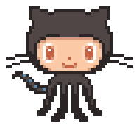

  <a href="https://www.qoo.monster">
    <picture>
      <!--- light: https://capsule-render.vercel.app/api?type=waving&color=gradient&customColorList=6&height=120&section=header&text=qo̱ọmŏ̎n&fontSize=32&animation=fadeIn&fontAlignY=30&desc=%F0%9F%8C%B3%20Go%20for%20it.&descSize=12&descAlignY=46&descAlign=54.5&fontColor=1d1d1d --->
      <!--- dark: https://capsule-render.vercel.app/api?type=waving&color=gradient&customColorList=6&height=120&section=header&text=qo̱ọmŏ̎n&fontSize=32&animation=fadeIn&fontAlignY=30&desc=%F0%9F%8C%B3%20Go%20for%20it.&descSize=12&descAlignY=46&descAlign=54.5&fontColor=fefefe --->
      <source media="(prefers-color-scheme: dark)" 
        srcset="header-dark.svg">
       
    </picture>
  </a>

  
  
  &nbsp;&nbsp;&nbsp;
  

 

  
  <!--- show all trophies: https://github-profile-trophy.vercel.app/?username=qoomon --->
  <a href="https://github.com/ryo-ma/github-profile-trophy#readme">
    <picture>
      <source media="(prefers-color-scheme: dark)" 
      srcset="github-profile-trophy/LongTimeUser-dark.svg">
      </picture></a>
  <a href="https://github.com/ryo-ma/github-profile-trophy#readme">
    <picture>
      <source media="(prefers-color-scheme: dark)" 
        srcset="github-profile-trophy/Experience-dark.svg">
      </picture></a>
  <a href="https://github.com/ryo-ma/github-profile-trophy#readme">
    <picture>
      <source media="(prefers-color-scheme: dark)" 
        srcset="github-profile-trophy/Stars-dark.svg">
      </picture></a>
  <a href="https://github.com/ryo-ma/github-profile-trophy#readme">
    <picture>
      <source media="(prefers-color-scheme: dark)" 
        srcset="github-profile-trophy/Repositories-dark.svg">
      </picture></a>
  <a href="https://github.com/ryo-ma/github-profile-trophy#readme">
    <picture>
      <source media="(prefers-color-scheme: dark)" 
        srcset="github-profile-trophy/MultiLanguage-dark.svg">
      </picture></a>
   
  
  <a href="https://github.com/ryo-ma/github-profile-trophy#readme">
    <picture>
      <source media="(prefers-color-scheme: dark)" 
        srcset="github-profile-trophy/PullRequest-dark.svg">
      </picture></a>
  <a href="https://github.com/ryo-ma/github-profile-trophy#readme">
    <picture>
      <source media="(prefers-color-scheme: dark)" 
        srcset="github-profile-trophy/Commits-dark.svg">
      </picture></a>
  <a href="https://github.com/ryo-ma/github-profile-trophy#readme">
    <picture>
      <source media="(prefers-color-scheme: dark)" 
        srcset="github-profile-trophy/Issues-dark.svg">
      </picture></a>
  <a href="https://github.com/ryo-ma/github-profile-trophy#readme">
    <picture>
      <source media="(prefers-color-scheme: dark)" 
        srcset="github-profile-trophy/Followers-dark.svg">
      </picture></a>
  <a href="https://github.com/ryo-ma/github-profile-trophy#readme">
    <picture>
      <source media="(prefers-color-scheme: dark)" 
        srcset="github-profile-trophy/Reviews-dark.svg">
      </picture></a>

##

 

  
  
  <a href="https://gist.github.com/qoomon/5dfcdf8eec66a051ecd85625518cfd13"><picture>
    <source media="(prefers-color-scheme: dark)" srcset="stats-cards/conventional-commits-cheatsheet-dark.svg">
    </picture></a>
  
  <a href="https://github.com/qoomon/git-conventional-commits"><picture>
      <source media="(prefers-color-scheme: dark)" srcset="stats-cards/git-conventional-commits-dark.svg">
      </picture></a> &nbsp;
  <a href="https://github.com/qoomon/actions--access-token"><picture>
      <source media="(prefers-color-scheme: dark)" srcset="stats-cards/actions--access-token-dark.svg">
      </picture></a> &nbsp;

  <a href="https://github.com/qoomon/gradle-git-versioning-plugin"><picture>
      <source media="(prefers-color-scheme: dark)" srcset="stats-cards/gradle-git-versioning-plugin-dark.svg">
      </picture></a> &nbsp;
  <a href="https://github.com/qoomon/docker-host"><picture>
      <source media="(prefers-color-scheme: dark)" srcset="stats-cards/docker-host-dark.svg">
      </picture></a> &nbsp;
  
  <a href="https://github.com/qoomon/aws-s3-bucket-browser"><picture>
      <source media="(prefers-color-scheme: dark)" srcset="stats-cards/aws-s3-bucket-browser-dark.svg">
      </picture></a> &nbsp;
  <a href="https://github.com/qoomon/otp-authenticator-webapp"><picture>
      <source media="(prefers-color-scheme: dark)" srcset="stats-cards/otp-authenticator-webapp-dark.svg">
      </picture></a> &nbsp;
 
  <a href="https://github.com/qoomon/yolo-secret"><picture>
      <source media="(prefers-color-scheme: dark)" srcset="stats-cards/yolo-secret-dark.svg">
      </picture></a> &nbsp;
  <a href="https://github.com/qoomon/time-timer-webapp"><picture>
      <source media="(prefers-color-scheme: dark)" srcset="stats-cards/time-timer-webapp-dark.svg">
      </picture></a> &nbsp;
  
  <a href="https://github.com/qoomon/meeting-cash-creep"><picture>
      <source media="(prefers-color-scheme: dark)" srcset="stats-cards/meeting-cash-creep-dark.svg">
      </picture></a> &nbsp;
  <a href="https://github.com/qoomon/Jira-Issue-Card-Printer"><picture>
      <source media="(prefers-color-scheme: dark)" srcset="stats-cards/Jira-Issue-Card-Printer-dark.svg">
      </picture></a> &nbsp;
  
  <a href="https://github.com/qoomon/banking-swift-messages-java"><picture>
      <source media="(prefers-color-scheme: dark)" srcset="stats-cards/banking-swift-messages-java-dark.svg">
      </picture></a> &nbsp;

##

 

<!-- my-badges start -->

<!-- my-badges end -->

 
 

     

